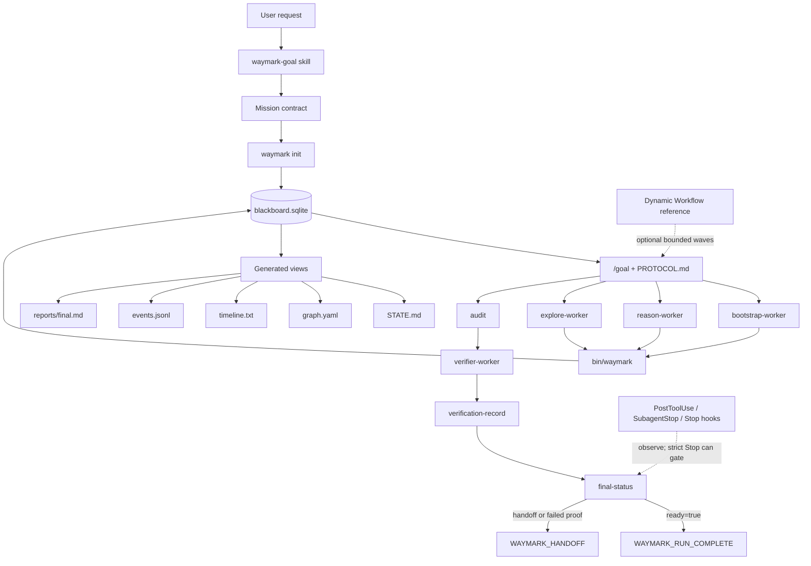

# Waymark

### Durable blackboard coordination for Claude Code agents


[](https://github.com/Y4tacker/Waymark/stargazers)

## What Waymark Is

Waymark is a Claude Code plugin for running long-horizon agent work through a persistent, SQLite-backed blackboard instead of a fragile chat transcript. A user-approved mission contract seeds a Fact-Intent graph; Claude subagents then coordinate indirectly by writing durable facts, intents, claims, releases, completion evidence, and verification records through the `waymark` CLI.

The CLI and `blackboard.sqlite` are the authority. Generated files such as `STATE.md`, `graph.yaml`, `timeline.txt`, `events.jsonl`, `hook-events.jsonl`, and `reports/final.md` are views and logs for humans and agents. A run is complete only when `waymark final-status --json` returns `ready=true`.

Waymark is domain-general. It can drive software work, research, writing, data analysis, planning, or any task where the final state can be described as evidence-backed criteria rather than a vague "done" claim.

## The Problem

Long-running agent work has a state problem:

- Chat transcripts compact, drift, and bury the facts that matter.
- Direct worker-to-worker conversation creates hidden dependencies and unreviewable coordination.
- "Done" claims are cheap unless they are backed by criteria, evidence, and verification.
- Parallel or resumed work needs durable leases and a shared state model, not another prompt convention.
- Hooks and stop conditions are easy to overstate unless they are explicitly read-only or explicitly authoritative.

## Core Idea

Waymark separates mission, coordination, execution, and completion proof:

1. `waymark-goal` drafts a mission contract: origin, goal, falsifiable acceptance criteria, constraints, assumptions, and handoff triggers.
2. The user reviews that contract before `waymark init`; init is the semantic commitment point.
3. The CLI stores the contract and graph state in `blackboard.sqlite`.
4. `/goal + PROTOCOL.md` supervises the run and dispatches subagents, but it does not own semantic state.
5. Workers mutate state only through `bin/waymark`.
6. `audit`, `verify`, `verification-record`, and `final-status` decide whether completion is real.



## Design Philosophy

Waymark is built around explicit principle/mechanism pairs.

| Principle                                   | Mechanism                                                    |
| ------------------------------------------- | ------------------------------------------------------------ |
| Blackboard over transcript                  | `blackboard.sqlite` stores authoritative project, fact, intent, criteria, lease, hint, event, and verification state. Markdown/YAML/text/JSONL files are generated views. |
| Stigmergy over direct messaging             | Workers coordinate by leaving facts, intents, claims, releases, and verification records. They do not depend on private worker-to-worker chat. |
| Mission contract before autonomy            | `waymark-goal` confirms origin, goal, criteria, constraints, assumptions, and handoff triggers before `waymark init` writes durable state. |
| Append-only evidence                        | Facts are evidence records. Corrections and contradictions are represented as new facts/intents or `waymark reopen`, not by silently editing old evidence. |
| Leased work, not loose tasks                | Intent leases, reason leases, heartbeats, release counts, abandonment, and lazy expiry make work ownership explicit. |
| Thin supervisor                             | `/goal` runs `PROTOCOL.md`, dispatches workers, and reads checkpoints; semantic state lives in SQLite through the CLI. |
| Audit and verification over self-report     | `audit` checks graph structure and criteria mappings; `verify` reports evidence coverage; `verification-record` persists the verifier verdict; `final-status` is the completion gate. |
| Observable by default, gated only by opt-in | Hooks log observations by default. Only `WAYMARK_STRICT_HOOKS=1` turns the `Stop` hook into a read-only completion gate. |

## Why Subagents

Waymark uses Claude Code subagents as worker contracts, not as a replacement for the blackboard. Each subagent has one narrow responsibility:

- `bootstrap-worker` tests whether the mission can be completed directly.
- `reason-worker` decides what evidence is still missing and creates intents.
- `explore-worker` claims one intent and produces one evidence fact.
- `verifier-worker` challenges the completion evidence and records a durable verdict.

This separation keeps the `/goal` supervisor thin. The supervisor schedules protocol steps, but workers perform the domain reasoning and write their own state transitions through `bin/waymark`. That avoids a central transcript becoming the hidden state machine.

Subagents also keep context scoped. A reason worker reads a compact brief; an explore worker reads one intent and its source facts; the verifier reads the completion evidence. Workers do not need to load the entire graph unless the scoped view is insufficient.

The important boundary is that subagent output is never truth by itself. A worker's prose can explain what happened, but only CLI mutations in SQLite count as state.

## Feature Map

| Feature                      | Where it lives                                               | Purpose                                                      |
| ---------------------------- | ------------------------------------------------------------ | ------------------------------------------------------------ |
| Mission-contract initializer | `skills/waymark-goal/SKILL.md`                               | Drafts and reviews the run seed before initialization.       |
| CLI blackboard               | `bin/waymark`, `blackboard.sqlite`                           | Stores and validates durable graph state.                    |
| Protocol supervisor          | `templates/PROTOCOL.md`                                      | Tells `/goal` how to dispatch the run.                       |
| Bootstrap worker             | `agents/bootstrap-worker.md`                                 | Attempts a direct first-pass completion or records bootstrap noop. |
| Reason worker                | `agents/reason-worker.md`                                    | Reads scoped state, creates intents, or completes when evidence is sufficient. |
| Explore worker               | `agents/explore-worker.md`                                   | Claims one open intent and concludes it with a fact or releases it with a reason. |
| Verifier worker              | `agents/verifier-worker.md`                                  | Re-checks evidence and persists a pass/fail verifier record. |
| Generated views              | `STATE.md`, `graph.yaml`, `timeline.txt`, `events.jsonl`, `reports/final.md` | Make the blackboard inspectable without making views authoritative. |
| Hooks                        | `PostToolUse`, `SubagentStop`, `Stop` from `hooks/hooks.json` | Observe runs and optionally gate stop attempts in strict mode. |
| Optional scale reference     | `templates/DYNAMIC_WORKFLOW_REFERENCE.js`                    | Shows how Dynamic Workflow could dispatch bounded explore waves. |
| Completion gate              | `waymark final-status --json`                                | Combines audit, criteria, handoff state, and durable verification into one decision. |

## How A Run Progresses

The default protocol loop is intentionally small:

1. `bootstrap-worker` tries to solve directly.
2. `reason-worker` reads `waymark brief`, decides whether more evidence is needed, and creates intents.
3. `explore-worker` claims exactly one intent with the CLI and concludes it with a fact or releases it.
4. `waymark round-start` and `waymark checkpoint` measure progress and decide whether to continue or hand off.
5. `waymark audit` checks graph structure and criteria mappings.
6. `verifier-worker` runs `waymark verify`, re-checks evidence, and persists `waymark verification-record`.
7. `waymark final-status --json` decides whether `WAYMARK_RUN_COMPLETE` is allowed.

This is not a coding-only planner. For a research task, facts may be source-backed findings; for writing, facts may be draft artifacts and editorial checks; for data analysis, facts may be tables, plots, or reproducible commands; for software, facts may be tests, diffs, and build evidence.

## Hooks

Waymark installs three Claude Code hooks through `hooks/hooks.json`:

| Hook           | Matcher | Default behavior                                             |
| -------------- | ------- | ------------------------------------------------------------ |
| `PostToolUse`  | `Bash`  | Records non-Waymark Bash observations for the latest active run. |
| `SubagentStop` | `*`     | Records that a subagent stopped while a run was active.      |
| `Stop`         | `*`     | Records the stop event and reminds the session to checkpoint if graph state changed. |

Hooks are observational by default:

- They find the latest active `.waymark/*/blackboard.sqlite` run in the current project.
- They append hook observations to `hook-events.jsonl`.
- They skip Waymark CLI calls because CLI mutations already write `events.jsonl`.
- They do not create facts, intents, completions, criteria, or verification records.
- They do not repair state and they are not an orchestration layer.

Strict hooks are opt-in. With `WAYMARK_STRICT_HOOKS=1`, the `Stop` hook becomes a read-only completion gate:

- It runs `waymark final-status --json`.
- It blocks stopping only when the run is not ready and not intentionally handed off.
- It allows stopping when `ready=true`, `should_handoff=true`, or `status=handoff`.
- It reports the next required action for statuses such as `not_completed`, `audit_failed`, `verification_missing`, or `verification_failed`.
- It never mutates graph state; `final-status` remains the only completion authority.

Example:

```bash
WAYMARK_STRICT_HOOKS=1 claude --plugin-dir /absolute/path/to/waymark
```

## Claude Code Runtime Mapping

Waymark is deliberately not a Cairn server port. It keeps Cairn's blackboard coordination model but lets Claude Code provide the runtime: slash-command supervision, subagent dispatch, hooks, and optional Dynamic Workflow scheduling. The only durable state layer is a Python stdlib CLI over SQLite.

| Cairn capability             | Waymark implementation on Claude Code                    |
| ---------------------------- | -------------------------------------------------------- |
| Blackboard graph             | `blackboard.sqlite` plus `waymark` CLI validation        |
| Dispatcher                   | `/goal` running `PROTOCOL.md`                            |
| Worker tasks                 | Claude Code subagents in `agents/`                       |
| Bootstrap / Reason / Explore | Dedicated subagent contracts                             |
| Graph consistency API        | Waymark CLI commands and SQLite transactions             |
| Protocol / event stream      | Generated run views plus `events.jsonl`                  |
| External reopen / human hint | `waymark reopen` and `waymark hint-add`                  |
| Parallel exploration         | Optional Dynamic Workflow reference dispatcher           |
| Observability                | Claude Code hooks and generated run views                |
| Completion proof             | `audit`, `verify`, `verification-record`, `final-status` |

Lightweight by design means no long-running daemon, no REST server, no Docker worker runtime, no MCP in the mutation path, and no custom orchestrator needed for normal use. The default runtime is just Claude Code plugin primitives plus `bin/waymark`.

## Runtime Modes

| Mode                        | Dispatcher                   | Best for                                               | Status                                                       |
| --------------------------- | ---------------------------- | ------------------------------------------------------ | ------------------------------------------------------------ |
| Default lightweight runtime | `/goal + PROTOCOL.md`        | Sequential supervision, normal runs, easiest debugging | Implemented and installed by default                         |
| Optional scale runtime      | Claude Code Dynamic Workflow | Bounded parallel explore waves and larger runs         | Adapter contract and reference dispatcher only; not yet a fully installed native runtime |

The default path is intentionally lightweight: `/goal` runs the protocol, dispatches subagents, and lets every durable state change go through `bin/waymark`. It is the easiest mode to inspect because the supervisor transcript, generated views, SQLite state, and CLI audit all line up in one local run directory.

The optional scale mode is documented in [templates/WORKFLOW_GUIDE.md](templates/WORKFLOW_GUIDE.md), with a near-runnable reference dispatcher in [templates/DYNAMIC_WORKFLOW_REFERENCE.js](templates/DYNAMIC_WORKFLOW_REFERENCE.js). It schedules bounded parallel explore waves but still does not own state, and it is not the default or required for normal use.

What ships today is an adapter contract plus a reference dispatcher, not yet a fully installed native runtime. In both modes, dispatchers schedule; CLI + SQLite own state. A dispatcher reads `checkpoint`, `audit`, `verify`, `final-status`, or generated views. It must not treat worker prose as truth.

SQLite is the transaction and recovery layer, not just storage. Intent claims, completion decisions, criteria mappings, and verification records are persisted through CLI transactions so a resumed supervisor or workflow dispatcher can recover from the checkpoint instead of conversational memory.

## Why Dynamic Workflow Is Optional

Dynamic Workflow is useful when scheduling becomes the bottleneck, not when state management becomes complicated. Waymark's state model does not change: workers still claim intents through the CLI, SQLite still prevents double-claims, and `final-status` still gates completion.

The default `/goal + PROTOCOL.md` runtime stays preferred for normal runs because it is linear, inspectable, and easy to debug. One supervisor transcript, one run directory, generated views, and CLI audit output all point at the same state.

The Dynamic Workflow reference exists for larger runs where bounded parallel explore waves are worth the extra moving parts. It can dispatch several `explore-worker` instances in one wave, but it must remain a dispatcher only:

- It does not mutate `blackboard.sqlite` directly.
- It does not trust worker prose as state.
- It reads structured CLI outputs such as `checkpoint`, `audit`, `verify`, and `final-status`.
- It uses a conservative parallel cap as a starting point, not as an architectural limit.

In short: subagents define worker responsibilities; Dynamic Workflow can scale scheduling. Neither replaces the blackboard.

## Inspired By

Waymark is inspired by [Cairn](https://github.com/oritera/Cairn)'s blackboard architecture: a shared Fact-Intent graph, stigmergic coordination, indirect worker communication, and durable graph growth as the record of problem solving.

Waymark implements that coordination shape on Claude Code's built-in substrate instead of recreating Cairn's infrastructure. Cairn is server-and-dispatcher based; Waymark uses `/goal`, subagents, hooks, and an optional Dynamic Workflow reference around a local stdlib CLI, SQLite storage, scoped worker context, and a completion gate centered on `final-status.ready=true`.

## Core Concepts

| Concept             | Meaning                                                      |
| ------------------- | ------------------------------------------------------------ |
| Project             | One durable run with origin, goal, status, settings, and baseline git ref |
| Fact                | Append-only evidence node, optionally carrying `evidence_cmd` or `evidence_path` |
| Intent              | Directed work edge from source facts to a future fact        |
| Origin              | The starting fact for the run                                |
| Goal                | The special completion target fact                           |
| Criterion           | Falsifiable acceptance check declared at init                |
| Hint                | Human guidance that can influence future workers but cannot satisfy completion alone |
| Checkpoint          | Compact scheduling state used by `/goal` and workflow dispatchers |
| Audit               | Structural completion proof over the graph                   |
| Verify              | Evidence report consumed by `verifier-worker`                |
| Verification Record | Durable verifier verdict persisted in SQLite                 |
| Final Status        | Single completion decision combining audit, criteria, handoff, and verification |

## Project Status

| Field                | Value                                                        |
| -------------------- | ------------------------------------------------------------ |
| Version              | `0.1.0`                                                      |
| License              | `MIT`                                                        |
| Runtime              | Claude Code plugin plus local CLI                            |
| Storage              | SQLite database per run                                      |
| Dependencies         | Python standard library only                                 |
| Default runtime      | `/goal + PROTOCOL.md`                                        |
| Optional scale mode  | Dynamic Workflow adapter/reference, not the default installed runtime |
| Repository           | [Y4tacker/Waymark](https://github.com/Y4tacker/Waymark)      |

## Requirements

- Claude Code with plugin support.
- `python3` on `PATH`.
- macOS or Linux preferred.
- No external Python packages.
- SQLite through Python's standard library.

## Install

For local development, load the plugin from this checkout:

```bash
claude --plugin-dir /absolute/path/to/waymark
```

For marketplace-style installation inside Claude Code:

```text
/plugin marketplace add https://github.com/Y4tacker/Waymark.git
/plugin install waymark@waymark
/reload-plugins
```

The plugin manifest lets Claude Code discover `skills/`, `agents/`, `hooks/`, and `bin/` automatically.

## Use

The intended user path starts with the `waymark-goal` skill:

1. Ask Claude Code to use Waymark for a task.
2. The skill drafts a mission contract: origin, goal, falsifiable criteria, constraints, assumptions, and handoff triggers.
3. Review and confirm the contract.
4. Paste the generated `/goal` dispatch command.
5. Waymark runs until `waymark final-status --json` returns `ready=true` or a handoff condition is reached.

Slash commands only fire from user input, so the final `/goal` paste is an honest dispatch step. It is not an extra semantic planning gate.

## CLI Smoke Test

Run this from the repository root:

```bash
bin/waymark init --run .waymark/example \
  --title "Example" \
  --origin "starting point" \
  --goal "finished objective" \
  --criterion "the objective is verifiably complete"

bin/waymark checkpoint --run .waymark/example --json
bin/waymark audit --run .waymark/example --json
```

An active project audit returning `ok=false` is expected. Completion requires a concluded completion intent, criteria support, and a passing verification record.

## CLI Examples

All mutating commands that accept structured data read JSON from stdin. This keeps shell quoting out of the protocol.

Create a run:

```bash
bin/waymark init --run .waymark/example-001 \
  --title "Example" \
  --origin "starting point" \
  --goal "finished objective" \
  --criterion "the final state is verified"
```

Read scheduling context:

```bash
bin/waymark brief --run .waymark/example-001 --json
bin/waymark checkpoint --run .waymark/example-001 --json
```

Create and claim work:

```bash
printf '%s\n' '{"from":["origin"],"description":"collect evidence"}' \
  | bin/waymark intent-create --run .waymark/example-001 --creator reason-worker --stdin

bin/waymark intent-claim --run .waymark/example-001 --worker explore-worker --json
bin/waymark context --run .waymark/example-001 --intent i001 --json
```

Conclude work and complete:

```bash
printf '%s\n' '{"description":"evidence collected","evidence_path":"reports/final.md"}' \
  | bin/waymark intent-conclude --run .waymark/example-001 --intent i001 --worker explore-worker --stdin

printf '%s\n' '{"from":["f001"],"description":"goal satisfied"}' \
  | bin/waymark complete --run .waymark/example-001 --worker reason-worker --stdin
```

Verify and gate completion:

```bash
bin/waymark audit --run .waymark/example-001 --json
bin/waymark verify --run .waymark/example-001 --json

printf '%s\n' '{"verified":true,"evidence":"evidence re-checked"}' \
  | bin/waymark verification-record --run .waymark/example-001 --worker verifier-worker --stdin

bin/waymark final-status --run .waymark/example-001 --json
```

## Run Artifacts

A run directory contains durable state plus generated views:

```text
.waymark/<run>/
+-- blackboard.sqlite      # source of truth
+-- PROTOCOL.md            # copied dispatch protocol
+-- STATE.md               # generated state view
+-- graph.yaml             # generated graph view
+-- timeline.txt           # generated event timeline
+-- events.jsonl           # CLI event log
+-- hook-events.jsonl      # hook observation log
+-- reports/
|   +-- final.md
+-- snapshots/
```

Only `blackboard.sqlite` is authoritative. The other files are for inspection, debugging, handoff, and review.

## Safety Model

- Intent leases prevent double-claims.
- Reason leases keep planning single-writer.
- Open-intent caps bound runaway planning.
- Three releases abandon an intent and surface it back to reasoning.
- Lazy lease expiry happens during CLI operations.
- `reopen` injects corrective evidence and invalidates prior verification.
- Hooks are observational by default.
- `WAYMARK_STRICT_HOOKS=1` makes `Stop` a read-only completion gate, not a repair path.

Completion requires all of the following:

- The project status is completed.
- A concluded completion intent points to the special `goal` fact.
- Supporting facts are not the `goal` fact itself.
- Every acceptance criterion maps to supporting facts.
- `waymark audit --json` returns `ok=true`.
- The latest durable verification record is a pass.
- `waymark final-status --json` returns `ready=true`.

## Tests

Run the regression suite:

```bash
python3 -m unittest tests/test_waymark_cli.py
```

The tests cover initialization, special facts, scoped IDs, intent and reason leases, lazy expiry, FIFO and priority claiming, open-intent caps, three-strike abandonment, round tracking, `should_reason`, criteria mapping, verification records, `final-status`, scoped views, exports, hook filtering, strict stop gates, and worker contract validation.

## Deeper Reference

- [templates/PROTOCOL.md](templates/PROTOCOL.md) - autonomous `/goal` dispatch protocol.
- [templates/WORKFLOW_GUIDE.md](templates/WORKFLOW_GUIDE.md) - optional Dynamic Workflow adapter contract.
- [templates/DYNAMIC_WORKFLOW_REFERENCE.js](templates/DYNAMIC_WORKFLOW_REFERENCE.js) - reference scale-mode dispatcher.
- [agents/bootstrap-worker.md](agents/bootstrap-worker.md) - bootstrap worker contract.
- [agents/reason-worker.md](agents/reason-worker.md) - reason worker contract.
- [agents/explore-worker.md](agents/explore-worker.md) - explore worker contract.
- [agents/verifier-worker.md](agents/verifier-worker.md) - verifier worker contract.
- [skills/waymark-goal/SKILL.md](skills/waymark-goal/SKILL.md) - mission-contract drafting skill.
- [hooks/hooks.json](hooks/hooks.json) - Claude Code hook wiring.
- [scripts/waymark_hook.py](scripts/waymark_hook.py) - observational hook handler and optional strict stop gate.

## Others 
[](https://www.star-history.com/#Y4tacker/Waymark&Date)

## License

MIT, as declared in [.claude-plugin/plugin.json](.claude-plugin/plugin.json).
